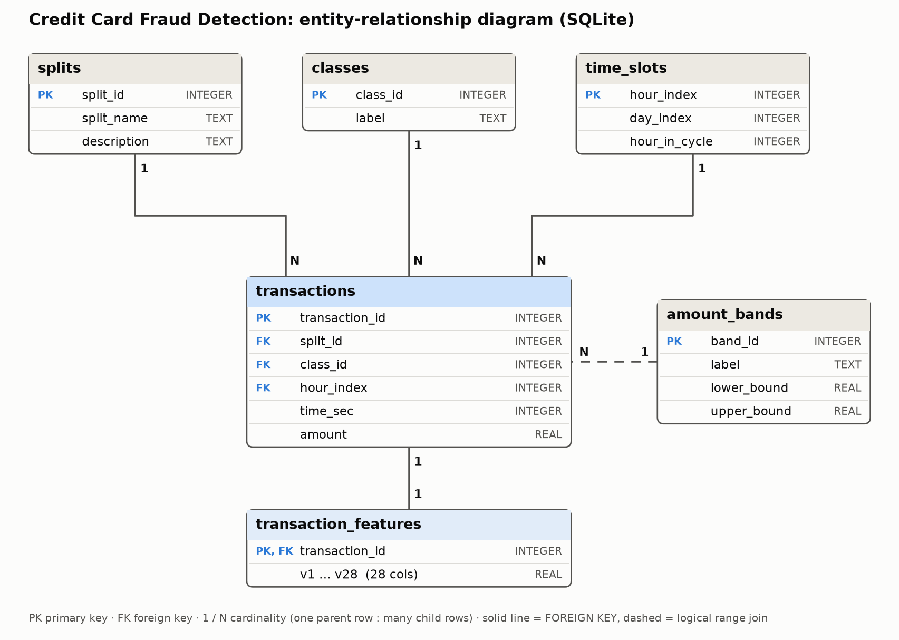
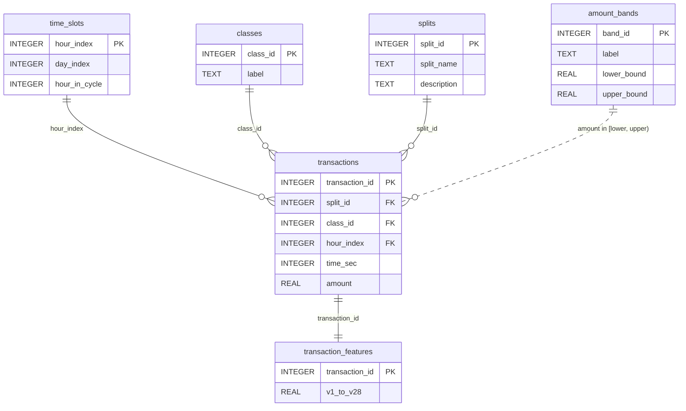

# ER diagram

Generated from the database by `python -m src.db.er_diagram` (do not edit by hand).

```mermaid
erDiagram
    transactions ||--|| transaction_features : "transaction_id"
    time_slots ||--o{ transactions : "hour_index"
    classes ||--o{ transactions : "class_id"
    splits ||--o{ transactions : "split_id"
    amount_bands ||..o{ transactions : "amount in [lower, upper)"
    amount_bands {
        INTEGER band_id PK
        TEXT label
        REAL lower_bound
        REAL upper_bound
    }
    classes {
        INTEGER class_id PK
        TEXT label
    }
    splits {
        INTEGER split_id PK
        TEXT split_name
        TEXT description
    }
    time_slots {
        INTEGER hour_index PK
        INTEGER day_index
        INTEGER hour_in_cycle
    }
    transaction_features {
        INTEGER transaction_id PK
        REAL v1_to_v28
    }
    transactions {
        INTEGER transaction_id PK
        INTEGER split_id FK
        INTEGER class_id FK
        INTEGER hour_index FK
        INTEGER time_sec
        REAL amount
    }
```
